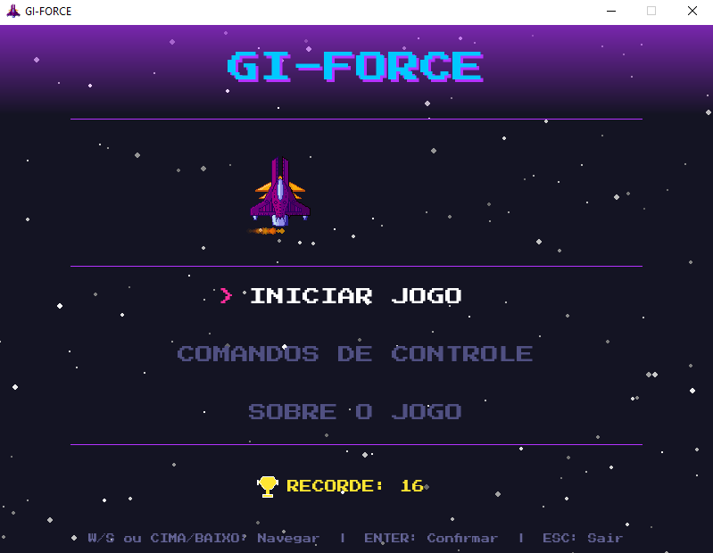
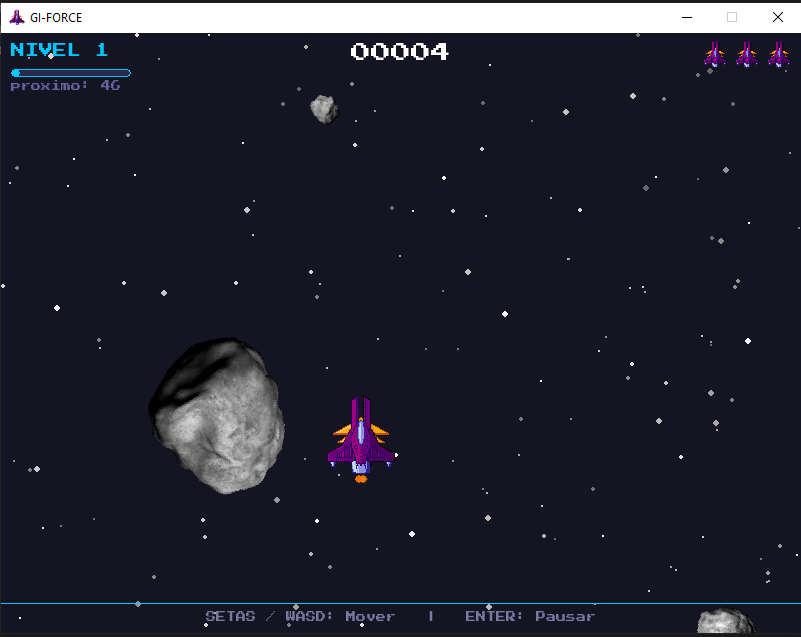
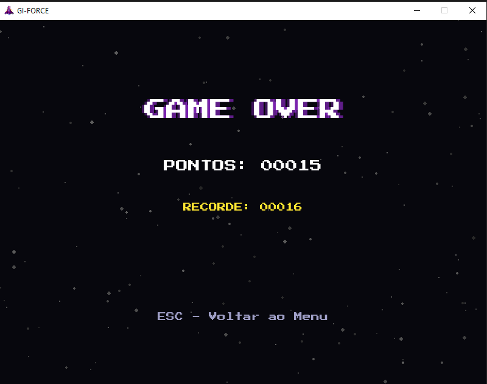

# 👩‍🚀🚀☄️ GI-FORCE


## 📖 Descrição

GI-FORCE é um jogo 2D de esquiva desenvolvido em Python com Pygame. Pilote uma nave espacial e desvire de meteoritos que caem em velocidade crescente. A dificuldade aumenta automaticamente a cada 50 pontos.

## 🖼️ Screenshots





No século XXIII, a exploração desenfreada tornou a Terra inabitável e quase extinguiu a humanidade. A astrofísica Giselle Pegado descobriu um planeta distante com gravidade semelhante à da Terra e o batizou de **Gi-Force**. Com os últimos sobreviventes a bordo, a nave parte rumo ao novo lar — mas uma implacável chuva de meteoros ameaça encerrar de vez a história da humanidade. Desviar é a única chance de sobrevivência.

## ✨ Funcionalidades

- Jogo 2D com janela gráfica
- Menu principal navegável
- Sistema de vidas com invencibilidade temporária
- Pontuação com recorde salvo
- Progressão automática de dificuldade
- Efeitos visuais: partículas, rastro de fogo, fundo estrelado
- Áudio: música de fundo e efeitos sonoros
- Pause e Game Over
- Executável Windows via PyInstaller

## ⚙️ Instalação

### Pré-requisitos

> [!IMPORTANT]
> É necessário ter **Python 3.8 ou superior** e **pip** instalados antes de prosseguir.

### Passos

1. Clone o repositório:

   ```bash
   git clone https://github.com/seu-usuario/gi-force.git
   cd gi-force
   ```

2. Instale as dependências:
   ```bash
   pip install -r requirements.txt
   ```

## 🎮 Como Jogar

Execute o jogo:

```bash
python main.py
```

### Controles

| Tecla                     | Ação                           |
| ------------------------- | ------------------------------ |
| `← → ↑ ↓` ou `W A S D`    | Mover a nave                   |
| `ENTER` ou `ENTER (num.)` | Confirmar / Pausar / Continuar |
| `ESC`                     | Voltar ao menu / Fechar        |

## 🛠️ Desenvolvimento

### Estrutura do Projeto

```
├── main.py              # Código principal do jogo
├── test_giforce.py      # Testes unitários
├── requirements.txt     # Dependências Python
├── build.bat            # Script para gerar .exe (Windows)
├── GiForce.spec         # Configuração PyInstaller
├── README.md            # Este arquivo
├── scores.json          # Arquivo de recordes
└── assets/
    ├── fonts/
    │   └── PressStart2P-Regular.ttf
    ├── images/
    │   ├── asteroid-small.png
    │   ├── asteroid-medium.png
    │   ├── asteroid-large.png
    │   ├── spaceship.png
    │   └── spaceship.ico
    └── sounds/
        ├── musica_menu.mp3
        ├── game_over.mp3
        ├── colisao.wav
        ├── select.wav
        ├── leave.wav
        ├── byebye.wav
        ├── dead.wav
        └── hallelujah.wav
```

### Testes

Execute os testes unitários:

```bash
python -m unittest test_giforce -v
```

### Build

Para gerar o executável Windows:

1. Instale PyInstaller:

   ```bash
   pip install pyinstaller
   ```

2. Execute o build:
   ```bash
   pyinstaller GiForce.spec
   ```
   Ou use `build.bat`.

## 📚 Conteúdos da Disciplina Aplicados

### Aula 1 — Bibliotecas Python

| Conteúdo                                    | Aplicação                                                   |
| ------------------------------------------- | ----------------------------------------------------------- |
| **[🎮 Pygame](concepts/pygame-library.md)** | Base do jogo: janela, eventos, desenho 2D, colisões, áudio  |
| **[💾 JSON](concepts/json-persistence.md)** | `carregar_recorde()` e `salvar_recorde()` via `scores.json` |

### Aula 2 — POO e UML

| Conteúdo                                              | Aplicação                                                                                                                  |
| ----------------------------------------------------- | -------------------------------------------------------------------------------------------------------------------------- |
| **[🧩 Classes](concepts/oop-classes.md)**             | `Nave`, `Meteorito`, `Particula`, `CampoEstelar`, `Jogo`, `EventManager`, `MeteoritoFactory`                               |
| **[🧩 Atributos e métodos](concepts/oop-classes.md)** | Encapsulamento em todas as classes                                                                                         |
| **[🧩 Instanciação](concepts/oop-classes.md)**        | Objetos criados dinamicamente durante o jogo                                                                               |
| **[🧬 Herança](concepts/inheritance.md)**             | `MeteoritoPequeno`, `MeteoritoMedio`, `MeteoritoGrande` herdam de `Meteorito`; todas as entidades herdam de `EntidadeJogo` |

### Aula 3 — Módulos e Design Patterns Criacionais

| Conteúdo                                                       | Aplicação                                                            |
| -------------------------------------------------------------- | -------------------------------------------------------------------- |
| **Módulos**                                                    | `pygame`, `math`, `random`, `sys`, `os`, `json`, `abc`               |
| **[🔷 ABC (Classes Abstratas)](concepts/abstract-classes.md)** | `EntidadeJogo(ABC)` com `@abstractmethod atualizar()` e `desenhar()` |
| **[🏭 Design Pattern Factory](concepts/factory-pattern.md)**   | `MeteoritoFactory.criar()` instancia a subclasse correta por tipo    |

### Aula 4 — Eventos, Decorators, List Comprehension e Design Patterns Comportamentais

| Conteúdo                                                       | Aplicação                                                                      |
| -------------------------------------------------------------- | ------------------------------------------------------------------------------ |
| **[⌨️ Eventos de teclado](concepts/keyboard-events.md)**       | `pygame.KEYDOWN` tratado em `_tratar_eventos()`                                |
| **[🔒 Decorator de classe](concepts/singleton-pattern.md)**    | `@singleton` aplicado ao `EventManager`                                        |
| **[🎀 Decorator de função](concepts/decorators.md)**           | `@validar_positivo` aplicado ao `salvar_recorde()`                             |
| **[📋 List Comprehension](concepts/list-comprehension.md)**    | Geração de estrelas, filtragem de partículas e meteoritos                      |
| **[📡 Design Pattern Observer](concepts/observer-pattern.md)** | `EventManager` com `assinar()` e `publicar()` para eventos de dano e game over |

### Aula 5 — Banco de Dados e Design Patterns Estruturais

| Conteúdo                                    | Aplicação                                             |
| ------------------------------------------- | ----------------------------------------------------- |
| **[💾 JSON](concepts/json-persistence.md)** | Persistência do recorde entre sessões (`scores.json`) |

### Aula 6 — Ferramentas e Testes

| Conteúdo                                                | Aplicação                                              |
| ------------------------------------------------------- | ------------------------------------------------------ |
| **[🧪 Testes Unitários](concepts/unit-testing.md)**     | `test_giforce.py` com 21 testes em 6 grupos (unittest) |
| **[📦 Geração de Executável](concepts/pyinstaller.md)** | PyInstaller via `GiForce.spec` e `build.bat`           |

## 🗂️ Documentação

A documentação completa está organizada na pasta [`docs/`](docs/):

| Categoria   | Artefatos                                                                                                                                                     |
| ----------- | ------------------------------------------------------------------------------------------------------------------------------------------------------------- |
| Modelagem   | [Diagrama de Classes](docs/1-modeling/1-classes.md)                                                                                                           |
| Arquitetura | [Visão Geral](docs/2-architecture/1-overview.md) · [Decisões (ADRs)](docs/2-architecture/2-decisions.md) · [Implantação](docs/2-architecture/3-deployment.md) |
| Testes      | [Plano de Testes](docs/3-tests/1-test-plan.md) · [Casos de Teste](docs/3-tests/2-test-cases.md)                                                               |

## 🧠 Conceitos explorados

Este projeto documenta os seguintes conceitos na pasta [`concepts/`](concepts/):

| Conceito                                                     | Descrição resumida                                                       |
| ------------------------------------------------------------ | ------------------------------------------------------------------------ |
| [🎮 Biblioteca Pygame](concepts/pygame-library.md)           | Janela, loop principal, renderização 2D e áudio do jogo                  |
| [💾 Persistência com JSON](concepts/json-persistence.md)     | Leitura e escrita do recorde em `scores.json`                            |
| [🧩 Orientação a Objetos — Classes](concepts/oop-classes.md) | `Nave`, `Meteorito`, `Jogo` e demais classes do projeto                  |
| [🧬 Herança](concepts/inheritance.md)                        | Hierarquia `EntidadeJogo` → `Meteorito` → subclasses                     |
| [🔷 Classes Abstratas com ABC](concepts/abstract-classes.md) | `EntidadeJogo(ABC)` com `@abstractmethod`                                |
| [🏭 Padrão Factory](concepts/factory-pattern.md)             | `MeteoritoFactory.criar()` instancia o tipo correto                      |
| [🔒 Padrão Singleton](concepts/singleton-pattern.md)         | `@singleton` garante instância única do `EventManager`                   |
| [📡 Padrão Observer](concepts/observer-pattern.md)           | `EventManager` com `assinar()` e `publicar()`                            |
| [⌨️ Eventos de Teclado](concepts/keyboard-events.md)         | `pygame.KEYDOWN` e `get_pressed()` para controle da nave                 |
| [🎀 Decorators](concepts/decorators.md)                      | `@validar_positivo` (função) e `@singleton` (classe)                     |
| [📋 List Comprehension](concepts/list-comprehension.md)      | Geração de estrelas e filtragem de partículas/meteoritos                 |
| [🧪 Testes Unitários](concepts/unit-testing.md)              | `test_giforce.py` com 21 testes em 6 grupos via `unittest`               |
| [🎭 Mocking em Testes](concepts/mocking.md)                  | Substituição do `pygame` por mocks para testes sem janela gráfica        |
| [📦 PyInstaller](concepts/pyinstaller.md)                    | Empacotamento do jogo em executável Windows                              |
| [🔁 Game Loop](concepts/game-loop.md)                        | Laço principal de 60 FPS com atualização e renderização por frame        |
| [🔀 Máquina de Estados](concepts/state-machine.md)           | Seis estados (`menu`, `jogando`, `pausado`…) controlando o fluxo do jogo |

> Os arquivos contêm explicações detalhadas e exemplos extraídos do projeto.

## 🤝 Contribuição

Contribuições são bem-vindas! Por favor, veja [CONTRIBUTING.md](CONTRIBUTING.md) para detalhes.

## 📄 Licença

Este projeto está licenciado sob a MIT License - veja o arquivo [LICENSE](LICENSE) para detalhes.

## 👩‍💻 Autor

- **Giselle Pegado** · ADS — UNINTER · 2026 — [GitHub](https://github.com/GisellePegado)

---

_Projeto desenvolvido como atividade prática para a disciplina Linguagem de Programação Aplicada - UNINTER_
