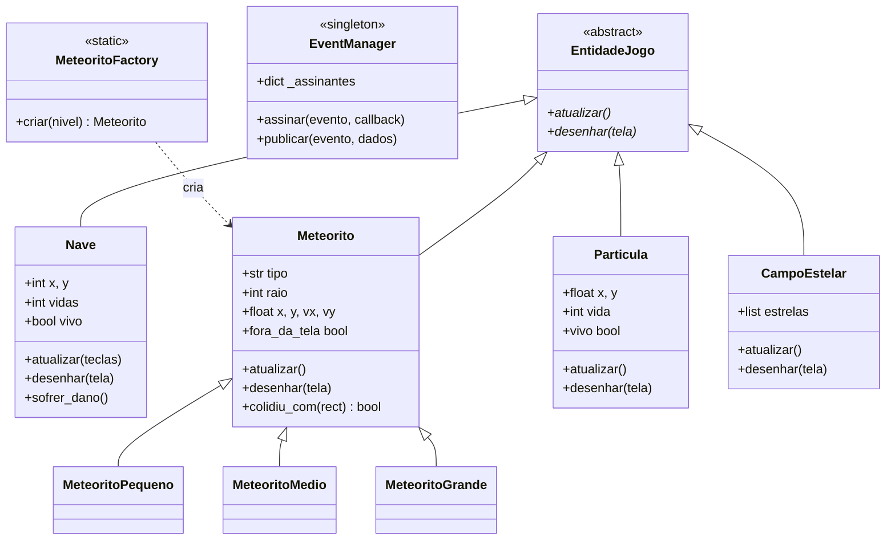

# 🏗️ Diagrama de Classes

> Extraído das classes definidas em `main.py`.

## 💎 Classes

### EntidadeJogo *(abstrata)*

| Atributo | Tipo | Descrição |
|----------|------|-----------|
| — | — | Classe puramente abstrata, sem atributos |

| Método | Retorno | Descrição |
|--------|---------|-----------|
| `atualizar()` | `None` | Atualiza o estado da entidade a cada frame (abstrato) |
| `desenhar(tela)` | `None` | Desenha a entidade na superfície fornecida (abstrato) |

---

### Nave

| Atributo | Tipo | Descrição |
|----------|------|-----------|
| `x`, `y` | `int` | Posição central da nave |
| `rect` | `pygame.Rect` | Hitbox para detecção de colisão |
| `vivo` | `bool` | Indica se a nave ainda está ativa |
| `invencivel` | `int` | Frames restantes de invencibilidade após dano |
| `vidas` | `int` | Número de vidas restantes (inicia em 3) |
| `trail` | `list[dict]` | Rastro de fogo com posição e vida de cada partícula |
| `direcao` | `int` | Sentido do movimento horizontal (1 = direita, -1 = esquerda) |
| `imagem` | `pygame.Surface \| None` | Sprite carregado de `spaceship.png` |

| Método | Retorno | Descrição |
|--------|---------|-----------|
| `atualizar(teclas)` | `None` | Move a nave e atualiza rastro com base nas teclas pressionadas |
| `desenhar(tela)` | `None` | Renderiza sprite ou fallback poligonal + rastro de fogo |
| `sofrer_dano()` | `None` | Reduz vidas e publica evento `"dano"` via `EventManager` |

---

### Meteorito

| Atributo | Tipo | Descrição |
|----------|------|-----------|
| `tipo` | `str` | `"pequeno"`, `"medio"` ou `"grande"` |
| `raio` | `int` | Raio para colisão e renderização |
| `pontos` | `int` | Pontuação concedida ao desviar |
| `x`, `y` | `float` | Posição na tela |
| `vx`, `vy` | `float` | Velocidade horizontal e vertical |
| `angulo` | `float` | Ângulo de rotação atual |
| `vel_rot` | `float` | Velocidade de rotação (positiva ou negativa) |
| `imagem` | `pygame.Surface \| None` | Sprite com cache em `_cache_imagens` |

| Método | Retorno | Descrição |
|--------|---------|-----------|
| `atualizar()` | `None` | Move e rotaciona o meteorito; rebate nas bordas laterais |
| `desenhar(tela)` | `None` | Renderiza sprite rotacionado ou polígono irregular como fallback |
| `colidiu_com(rect)` | `bool` | Detecta colisão por distância euclidiana |
| `fora_da_tela` *(property)* | `bool` | `True` quando o meteorito ultrapassa a borda inferior |

---

### MeteoritoPequeno / MeteoritoMedio / MeteoritoGrande

Subclasses de `Meteorito`. Cada uma apenas chama `super().__init__()` com seu tipo fixo. Herdam todos os atributos e métodos da classe-mãe.

---

### Particula

| Atributo | Tipo | Descrição |
|----------|------|-----------|
| `x`, `y` | `float` | Posição da partícula |
| `vx`, `vy` | `float` | Velocidade com direção aleatória |
| `vida` | `int` | Frames restantes antes de desaparecer |
| `vida_max` | `int` | Vida inicial (para cálculo de alpha) |
| `raio` | `int` | Raio de desenho |
| `cor` | `tuple` | Cor RGB da partícula |

| Método | Retorno | Descrição |
|--------|---------|-----------|
| `atualizar()` | `None` | Move a partícula e aplica gravidade leve |
| `desenhar(tela)` | `None` | Renderiza círculo semitransparente com alpha proporcional à vida |
| `vivo` *(property)* | `bool` | `True` enquanto `vida > 0` |

---

### CampoEstelar

| Atributo | Tipo | Descrição |
|----------|------|-----------|
| `estrelas` | `list[dict]` | 150 estrelas com posição, velocidade, raio e brilho aleatórios |

| Método | Retorno | Descrição |
|--------|---------|-----------|
| `atualizar()` | `None` | Move cada estrela para baixo; reposiciona no topo ao sair da tela |
| `desenhar(tela)` | `None` | Renderiza cada estrela como círculo cinza |

---

### EventManager *(Singleton)*

| Atributo | Tipo | Descrição |
|----------|------|-----------|
| `_assinantes` | `dict[str, list]` | Mapa de evento → lista de callbacks |

| Método | Retorno | Descrição |
|--------|---------|-----------|
| `assinar(evento, callback)` | `None` | Registra um callback para um tipo de evento |
| `publicar(evento, dados)` | `None` | Notifica todos os assinantes do evento |

---

### MeteoritoFactory

| Método | Retorno | Descrição |
|--------|---------|-----------|
| `criar(nivel)` *(static)* | `Meteorito` | Sorteia tipo, calcula velocidade e instancia a subclasse correta |

---

### Jogo

| Atributo | Tipo | Descrição |
|----------|------|-----------|
| `estado` | `str` | Estado atual da máquina de estados |
| `nave` | `Nave` | Instância do jogador |
| `meteoritos` | `list[Meteorito]` | Meteoritos ativos na tela |
| `particulas` | `list[Particula]` | Partículas de explosão ativas |
| `campo_estelar` | `CampoEstelar` | Fundo animado |
| `pontuacao` | `int` | Pontuação da sessão atual |
| `nivel` | `int` | Nível atual (aumenta a cada 50 pontos) |
| `melhor_pontuacao` | `int` | Recorde carregado do `scores.json` |

| Método | Retorno | Descrição |
|--------|---------|-----------|
| `rodar()` | `None` | Loop principal do jogo |
| `_tratar_eventos()` | `None` | Processa eventos de teclado e janela |
| `_iniciar_jogo()` | `None` | Reinicia nave, pontuação e listas |
| `_atualizar_jogo()` | `None` | Spawn, movimento, colisões e progressão de nível |
| `_ao_sofrer_dano(vidas)` | `None` | Callback Observer: gera partículas laranjas |
| `_ao_game_over(_)` | `None` | Callback Observer: explosão final + salva recorde |

---

## 🔗 Relacionamentos

| Classe A | Relação | Classe B | Descrição |
|----------|---------|----------|-----------|
| `Nave` | herança | `EntidadeJogo` | Nave é uma entidade do jogo |
| `Meteorito` | herança | `EntidadeJogo` | Meteorito é uma entidade do jogo |
| `Particula` | herança | `EntidadeJogo` | Partícula é uma entidade do jogo |
| `CampoEstelar` | herança | `EntidadeJogo` | Campo estelar é uma entidade do jogo |
| `MeteoritoPequeno` | herança | `Meteorito` | Especialização pequena |
| `MeteoritoMedio` | herança | `Meteorito` | Especialização média |
| `MeteoritoGrande` | herança | `Meteorito` | Especialização grande |
| `Jogo` | composição | `Nave` | Jogo possui e controla a nave |
| `Jogo` | composição | `CampoEstelar` | Jogo possui o fundo animado |
| `Jogo` | agregação | `Meteorito` | Jogo gerencia lista de meteoritos ativos |
| `Jogo` | agregação | `Particula` | Jogo gerencia lista de partículas ativas |
| `MeteoritoFactory` | criação | `Meteorito` | Fábrica instancia subclasses de Meteorito |
| `Jogo` | uso | `EventManager` | Jogo assina eventos via Singleton global |
| `Nave` | uso | `EventManager` | Nave publica eventos de dano e game over |

## 📊 Representação Mermaid

