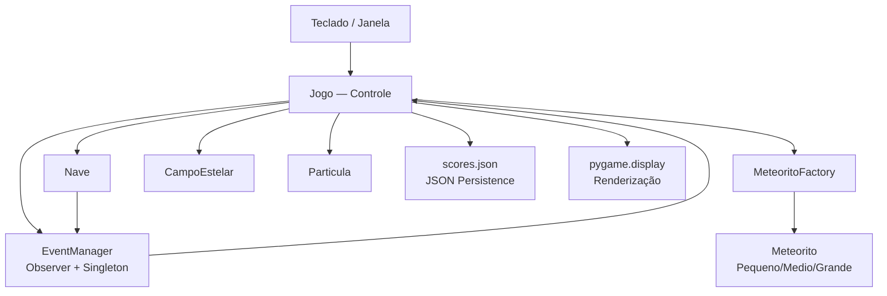

# 🏛️ Visão Geral da Arquitetura

## Estilo arquitetural

O GI-FORCE adota um estilo **monolítico em camadas**, concentrado em um único arquivo (`main.py`). A organização interna segue um modelo com três responsabilidades claras: entidades do domínio do jogo, gerenciamento de estado e coordenação via loop principal. Não há separação em módulos de arquivo, mas a separação de responsabilidades entre classes é bem definida.

## Camadas / Módulos

| Camada | Responsabilidade | Arquivos principais |
|--------|-----------------|---------------------|
| Infraestrutura | Inicialização de pygame, resolução de caminhos, persistência de recorde | `caminho_som()`, `caminho_imagem()`, `carregar_recorde()`, `salvar_recorde()` |
| Entidades | Lógica de cada objeto do jogo (movimento, colisão, renderização) | `EntidadeJogo`, `Nave`, `Meteorito`, `MeteoritoPequeno/Medio/Grande`, `Particula`, `CampoEstelar` |
| Serviços | Funcionalidades transversais compartilhadas entre entidades | `EventManager` (Observer + Singleton), `MeteoritoFactory` (Factory) |
| Controle | Máquina de estados, loop principal, spawn e progressão de nível | `Jogo` |
| Entrada | Processamento de eventos de teclado e janela | `Jogo._tratar_eventos()` |

## 📊 Diagrama de componentes

## 📦 Padrões adotados

| Padrão | Onde é aplicado |
|--------|----------------|
| Abstract Base Class | `EntidadeJogo` como contrato para todas as entidades |
| Herança | `Meteorito` → `MeteoritoPequeno/Medio/Grande`; `EntidadeJogo` → todas as entidades |
| Observer | `EventManager` conecta `Nave` (publicador) a `Jogo` (assinante) |
| Factory | `MeteoritoFactory.criar()` centraliza a criação de meteoritos |
| Singleton | `@singleton` garante instância única do `EventManager` |
| State Machine | `Jogo.estado` com 6 estados e transições via input e lógica |
| Game Loop | `Jogo.rodar()` com `clock.tick(FPS)` a 60 FPS |
| Decorator | `@singleton` (classe) e `@validar_positivo` (função) |
| List Comprehension | Geração de estrelas, filtragem de partículas e meteoritos |
| Image Cache | `Meteorito._cache_imagens` evita recarregar imagens do disco |
